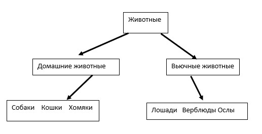

## Информация о проекте

Необходимо организовать систему учета для питомника в котором живут
домашние и вьючные животные.


### 1. Использование команды cat в Linux
Создать два текстовых файла: "Pets"(Домашние животные) и "Pack animals"(вьючные животные), 
используя команду `cat` в терминале Linux. В первом файле перечислить собак, кошек и хомяков.
Во втором — лошадей, верблюдов и ослов.


1.1. **Создание файлов**:
``` bash
cat > Pets <<EOL
Собаки
Кошки
Хомяки
EOL

cat > Pets <<EOL
Собаки
Кошки
Хомяки
EOL
```
1.2. **Объединить содержимое этих двух файлов в один и просмотреть его содержимое.**:

   ```bash
  cat Pets "Pack animals" > animal
   ```

1.3. **Просмотр содержимого файла**:

   ```bash
   vi animal
   ```
1.4. **Переименование файла**:

  ```bash
   mv animal HumanFriends.txt
   ```
### 2. Работа с директориями в Linux

2.1. **Создать новую директорию и переместить туда файл "HumanFriends.txt".**:

   ```bash
   mkdir animals
   ```
2.2. **Переместить файл "HumanFriends.txt" в новую директорию**:

      ```bash
   mv HumanFriends.txt animals
      ```

### 3. Работа с MySQL в Linux. “Установить MySQL на вашу вычислительную машину ”
   3.1 Подключите дополнительный репозиторий MySQL:
   ```bash
     wget https://dev.mysql.com/get/mysql-apt-config_0.8.33-1_all.deb
     dpkg -i mysql-apt-config_0.8.33-1_all.deb
     sudo apt-get update
   ```
   3.2 установить один из пакетов из этого репозитория.
   ```bash
     sudo apt-get install mysql-server
   ```
  
### 4. Управление deb-пакетами

4.1. **Установка deb-пакета**:

```bash
wget ftp.us.debian.org/debian/pool/main/b/b4/b4_0.14.2-2_all.deb
dpkg -i b4_0.14.2-2_all.deb
```

4.2. **Удаление deb-пакета**:

Удалите установленный пакет:
   ```bash
     dpkg -r b4
   ```

### 5. Сохранить и выложить историю ваших терминальных команд в Ubuntu.
В формате: Файла с ФИО, датой сдачи, номером группы(или потока)

5.1. **Сохранение истории команд**:
   ```bash
     history > history1.txt
   ```
5.2. **Сохранить и выложить историю ваших терминальных команд в Ubuntu**:
```bash
history > Kiselev_D_A.txt
```

   Создайте новый репозиторий на GitHub.

Склонируйте репозиторий на локальную машину:
   ```bash
     git clone https://github.com/vadvad81/Final-test-for-the-specialization_programmer-block.git
   ```
Переместите файл в репозиторий, выполните коммит и запушьте изменения:
   ```bash
     git checkout -b lesson_2
     git add Ermolov_Vadim_02.10.24_group_6381.txt
     git commit -m "Added command history"
     git push origin lesson2
   ```

### 6.	Диаграмма классов



### 7. В подключенном MySQL репозитории создать базу данных “Друзья человека”.

7.1 **После создания диаграммы классов в 6 пункте, в 7 пункте база данных "Human Friends" должна быть структурирована в соответствии с этой диаграммой**

Создаем 2 таблицы: которые будут соответствовать классам "Pets" и "Pack animals", и в этих таблицах будут поля, которые характеризуют каждый тип животных (имена, даты рождения, выполняемые команды).

таблица Pets:

| ID | Name     | Type    | BirthDate  | Commands              |
|----|----------|---------|------------|-----------------------|
| 1  | Fido     | Dog     | 2020-01-01 | Sit, Stay, Fetch      |
| 2  | Whiskers | Cat     | 2019-05-15 | Sit, Pounce           |
| 3  | Hammy    | Hamster | 2021-03-10 | Roll, Hide            |
| 4  | Buddy    | Dog     | 2018-12-10 | Sit, Paw, Bark        |
| 5  | Smudge   | Cat     | 2020-02-20 | Sit, Pounce, Scratch  |
| 6  | Peanut   | Hamster | 2021-08-01 | Roll, Spin            |
| 7  | Bella    | Dog     | 2019-11-11 | Sit, Stay, Roll       |
| 8  | Oliver   | Cat     | 2020-06-30 | Meow, Scratch, Jump   |
|    |          |         |            |                       |

таблица Pack animals:

| ID | Name    | Type   | BirthDate  | Commands                |
|----|---------|--------|------------|-------------------------|
| 1  | Thunder | Horse  | 2015-07-21 | Trot, Canter, Gallop    |
| 2  | Sandy   | Camel  | 2016-11-03 | Walk, Carry Load        |
| 3  | Eeyore  | Donkey | 2017-09-18 | Walk, Carry Load, Bray  |
| 4  | Storm   | Horse  | 2014-05-05 | Trot, Canter            |
| 5  | Dune    | Camel  | 2018-12-12 | Walk, Sit               |
| 6  | Burro   | Donkey | 2019-01-23 | Walk, Bray, Kick        |
| 7  | Blaze   | Horse  | 2016-02-29 | Trot, Jump, Gallop      |
| 8  | Sahara  | Camel  | 2015-08-14 | Walk, Run               |
|    |         |        |            |                         |


7.2 
 - В ранее подключенном MySQL создать базу данных с названием "Human Friends".
```MySQL
CREATE DATABASE `HumanFriends`;
USE `HumanFriends`;
```
 - Создать таблицы, соответствующие иерархии из вашей диаграммы классов.
```MySQL
CREATE TABLE `Pets` (
  `ID` INT AUTO_INCREMENT PRIMARY KEY,
  `Name` VARCHAR(50),
  `Type` VARCHAR(50),
  `BirthDate` DATE,
  `Commands` VARCHAR(255)
);

CREATE TABLE `PackAnimals` (
  `ID` INT AUTO_INCREMENT PRIMARY KEY,
  `Name` VARCHAR(50),
  `Type` VARCHAR(50),
  `BirthDate` DATE,
  `Commands` VARCHAR(255)
);

```
 - Заполнить таблицы данными о животных, их командах и датами рождения.
```MySQL
INSERT INTO `Pets` (`Name`, `Type`, `BirthDate`, `Commands`) VALUES
('Fido', 'Dog', '2020-01-01', 'Sit, Stay, Fetch'),
('Whiskers', 'Cat', '2019-05-15', 'Sit, Pounce'),
('Hammy', 'Hamster', '2021-03-10', 'Roll, Hide'),
('Buddy', 'Dog', '2018-12-10', 'Sit, Paw, Bark'),
('Smudge', 'Cat', '2020-02-20', 'Sit, Pounce, Scratch'),
('Peanut', 'Hamster', '2021-08-01', 'Roll, Spin'),
('Bella', 'Dog', '2019-11-11', 'Sit, Stay, Roll'),
('Oliver', 'Cat', '2020-06-30', 'Meow, Scratch, Jump');

INSERT INTO `PackAnimals` (`Name`, `Type`, `BirthDate`, `Commands`) VALUES
('Thunder', 'Horse', '2015-07-21', 'Trot, Canter, Gallop'),
('Sandy', 'Camel', '2016-11-03', 'Walk, Carry Load'),
('Eeyore', 'Donkey', '2017-09-18', 'Walk, Carry Load, Bray'),
('Storm', 'Horse', '2014-05-05', 'Trot, Canter'),
('Dune', 'Camel', '2018-12-12', 'Walk, Sit'),
('Burro', 'Donkey', '2019-01-23', 'Walk, Bray, Kick'),
('Blaze', 'Horse', '2016-02-29', 'Trot, Jump, Gallop'),
('Sahara', 'Camel', '2015-08-14', 'Walk, Run');

```
 - Удалить записи о верблюдах и объединить таблицы лошадей и ослов.
```MySQL
DELETE FROM `PackAnimals` WHERE `Type` = 'Camel';

CREATE TABLE `HorsesAndDonkeys` AS 
SELECT * FROM `PackAnimals` WHERE `Type` IN ('Horse', 'Donkey');

```
 - Создать новую таблицу для животных в возрасте от 1 до 3 лет и вычислить их возраст с точностью до месяца.
```MySQL
CREATE TABLE `YoungAnimals` AS
SELECT `ID`, `Name`, `Type`, `BirthDate`, `Commands`, 
       TIMESTAMPDIFF(MONTH, `BirthDate`, CURDATE()) AS `AgeInMonths`
FROM `Pets`
WHERE TIMESTAMPDIFF(MONTH, `BirthDate`, CURDATE()) BETWEEN 12 AND 36
UNION
SELECT `ID`, `Name`, `Type`, `BirthDate`, `Commands`, 
       TIMESTAMPDIFF(MONTH, `BirthDate`, CURDATE()) AS `AgeInMonths`
FROM `HorsesAndDonkeys`
WHERE TIMESTAMPDIFF(MONTH, `BirthDate`, CURDATE()) BETWEEN 12 AND 36;

```
 - Объединить все созданные таблицы в одну, сохраняя информацию о принадлежности к исходным таблицам.
```MySQL
CREATE TABLE `AllAnimals` AS
SELECT 'Pets' AS `SourceTable`, `ID`, `Name`, `Type`, `BirthDate`, `Commands`
FROM `Pets`
UNION ALL
SELECT 'HorsesAndDonkeys' AS `SourceTable`, `ID`, `Name`, `Type`, `BirthDate`, `Commands`
FROM `HorsesAndDonkeys`
UNION ALL
SELECT 'YoungAnimals' AS `SourceTable`, `ID`, `Name`, `Type`, `BirthDate`, `Commands`
FROM `YoungAnimals`;

```
Теперь таблица AllAnimals содержит все данные из таблиц "Pets", "HorsesAndDonkeys" и "YoungAnimals", с указанием источника каждой записи.

### 8.	Иерархия в Java
Создать иерархию классов в Pathon, который будет повторять диаграмму классов созданную в задаче 6 (Диаграмма классов)

### 9.	Программа-реестр домашних животных
Написать программу на Java, которая будет имитировать реестр домашних животных.

Должен быть реализован следующий функционал:

9.1 **Добавление нового животного**
Реализовать функциональность для добавления новых животных в реестр.  
Животное должно определяться в правильный класс (например, "собака", "кошка", "хомяк" и т.д.)

9.2 **Список команд животного**
Вывести список команд, которые может выполнять добавленное животное (например, "сидеть", "лежать").

9.3. **Обучение новым командам**
Добавить возможность обучать животных новым командам

9.4 **Вывести список животных по дате рождения**

9.5. **Навигация по меню**
Реализовать консольный пользовательский интерфейс с меню для навигации между вышеуказанными функциями
### 10.	Счетчик животных
Создать механизм, который позволяет вывести на экран общее количество созданных животных любого типа (Как домашних, так и вьючных), то есть при создании каждого нового животного счетчик увеличивается на «1».
